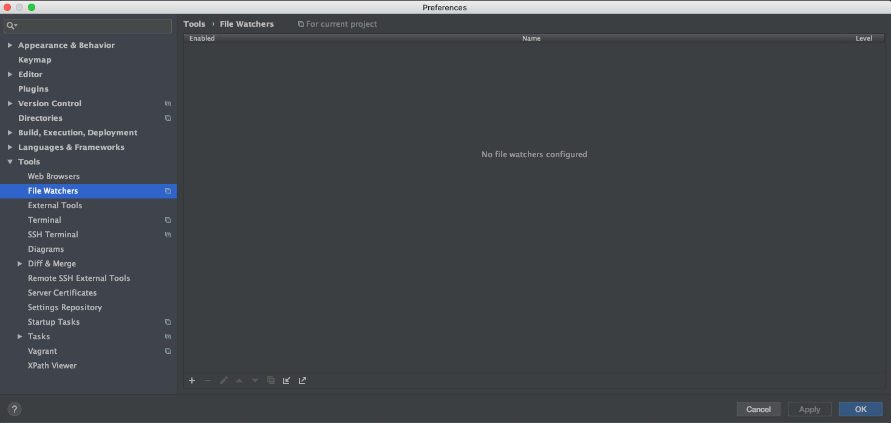
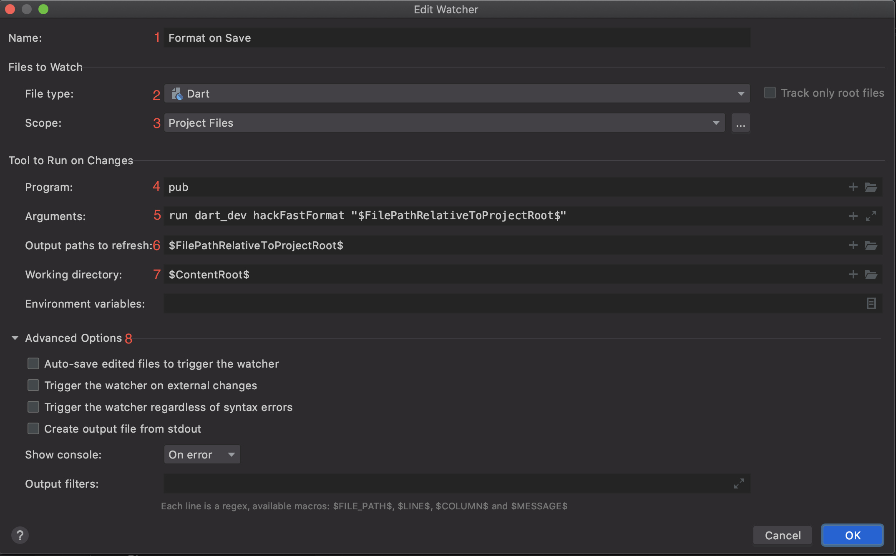

# Dart Dev Tools

[](https://pub.dev/packages/dart_dev)
[](https://github.com/Workiva/dart_dev/actions?query=workflow%3A%22Dart+CI%22+branch%3Amaster)

Centralized tooling for Dart projects. Consistent interface across projects.
Easily configurable.

---

- [Quick Start](#quick-start)
- [Motivation & Goal](#motivation--goal)
- [Project-Level Configuration](#project-level-configuration)
- [Extending/Composing Functionality](#extendingcomposing-functionality)
- [Shared Configuration](#shared-configuration)
- [Format on save](#format-on-save)
- [Additional Docs][docs]

## Quick Start

> Upgrading from v2? Check out the [upgrade guide][upgrade-guide].

> Looking for detailed guides on the available tools? Check out the
> [additional docs][docs].

Add `dart_dev` as a dev dependency in your project:

```bash
dart pub add --dev dart_dev
```

By default, this provides three core tasks:

- `analyze`
- `format`
- `test`

Run any of these tools via the `dart_dev` command-line app:

```bash
$ dart run dart_dev analyze
[INFO] Running subprocess:
dart analyze .
--------------------------
Analyzing dart_dev...
No issues found!
```

> We recommend adding a `ddev` alias:
>
> ```bash
> alias ddev='dart run dart_dev'
> ```

Additional Dart developer tools can be added and every tool can be configured.
To do this, create a `tool/dart_dev/config.dart` file like so:

```dart
// tool/dart_dev/config.dart
import 'package:dart_dev/dart_dev.dart';

final config = {
  // See the "Shared Configuration" section for more info on this.
  ...coreConfig,

  // Override or add new tools and configure them as desired.
  'analyze': AnalyzeTool(),
  'format': FormatTool(),
  'test': TestTool(),
  'serve': WebdevServeTool()
    ..webdevArgs = ['example:8080'],
};
```

## Motivation & Goal

Most Dart projects eventually share a common set of development requirements
(e.g. static analysis, formatting, test running, serving, etc.). The Dart SDK
along with some core packages supply the necessary tooling for these developer
tasks (e.g. `dart analyze`, `dart format`, or `dart test`).

While the core tooling gets us far, there are two areas in which we feel it
falls short:

1. Inconsistencies across projects in how these tools must be used in order to
   accomplish common developer tasks.

2. Functionality gaps for more complex use cases.

With `dart_dev`, we attempt to address #1 by providing a way to configure all of
these common developer tasks at the project level, and #2 by composing
additional functionality around existing tools.

This package is built with configurability and extensibility in mind, with the
hope that you and your teams will find value in creating your own tools and
shared configurations. Ideally, you or your team can settle on a shared
configuration that individual projects can consume; projects with unique
requirements can tweak the configuration as necessary; and developers can rely
on the convention of a simple, consistent command-line interface regardless of
the project they are in.

## Project-Level Configuration

Every task should be able to be configured at the project-level so that any
variance across projects becomes a configuration detail that need not be
memorized or referenced in order to run said task.

Consider formatting as an example. The default approach to formatting files is
to run `dartfmt -w .`. But, some projects may want to exclude certain files that
would otherwise be formatted by this command. Or, some projects may want to use
`pub run dart_style:format` instead of `dart format`. Currently, there is no
project-level configuration supported by the formatter, so these sorts of things
just have to be documented in a `README.md` or `CONTRIBUTING.md`.

With `dart_dev`, this can be accomplished like so:

```dart
// tool/dart_dev/config.dart
import 'package:dart_dev/dart_dev.dart';
import 'package:glob/glob.dart';

final config = {
  'format': FormatTool()
    ..exclude = [Glob('lib/src/**.g.dart')]
    ..formatter = Formatter.dartStyle,
};
```

```bash
$ ddev format
[INFO] Running subprocess:
dart run dart_style:format -w <3 paths>
--------------------------------------
Unchanged ./lib/foo.dart
Unchanged ./lib/src/bar.dart
Formatted ./lib/src/baz.dart
```

## Extending/Composing Functionality

Using existing tooling provided by (or conventionalized by) the Dart community
should always be the goal, but the reality is that there are gaps. Certain use
cases can be made more convenient and new use cases may arise.

Consider test running as an example. For simple projects, `dart test` is
sufficient. In fact, the test package supports a huge amount of project-level
configuration via `dart_test.yaml`, which means that for projects that are
properly configured, `dart test` just works.

Unfortunately, at this time, projects that rely on builders must run tests via
`dart run build_runner test`. Based on the project, you would need to know which
test command should be run.

With `dart_dev`, the `TestTool` handles this automatically by checking the
project's `pubspec.yaml` for a dependency on `build_test`. If present, tests
will be run via `dart run build_runner test`, otherwise it falls back to the
default of `dart test`.

```bash
# In a project without a `build_test` dependency:
$ ddev test
[INFO] Running subprocess:
dart test
----------------------------
00:01 +75: All tests passed!


# In a project with a `build_test` dependency:
$ ddev test
[INFO] Running subprocess:
dart run build_runner test
----------------------------
[INFO] Generating build script completed, took 425ms
[INFO] Creating build script snapshot... completed, took 13.6s
[INFO] Building new asset graph completed, took 960ms
[INFO] Checking for unexpected pre-existing outputs. completed, took 1ms
[INFO] Running build completed, took 12.4s
[INFO] Caching finalized dependency graph completed, took 71ms
[INFO] Creating merged output dir `/var/folders/vb/k8ccjw095q16jrwktw31ctmm0000gn/T/build_runner_testBkm6gS/` completed, took 260ms
[INFO] Writing asset manifest completed, took 3ms
[INFO] Succeeded after 12.8s with 1276 outputs (2525 actions)
Running tests...

00:00 +75: All tests passed!
```

Additionally, `TestTool` automatically applies [`--build-filter`][build-filter]
options to the `dart run build_runner test` command to help reduce build time and
speed up dev iteration when running a subset of the available tests.

Generally speaking, these dart tool abstractions provide a place to address
functionality gaps in the underlying tools or make certain use cases more
convenient or efficient.

## Shared Configuration

This package provides `coreConfig` as a minimal base configuration of `dart_dev`
tools. It is the default configuration if your project does not have a
`tool/dart_dev/config.dart`.

This shared config contains the following targets:

- `ddev analyze`
- `ddev format`
- `ddev test`

The actual configuration of each of these targets can be found here:
[`lib/src/core_config.dart`][core-config]

`coreConfig` is just a getter that returns a `Map<String, DevTool>` object, so
extending it or customizing it is as easy as creating your own `Map`, spreading
the shared config, and then adding your own entries:

```dart
// tool/dart_dev/config.dart
import 'package:dart_dev/dart_dev.dart';

final config = {
  ...coreConfig,

  // Override a target by including it after `...coreConfig`:
  'format': FormatTool()
    ..formatter = Formatter.dartFormat,

  // Add a custom target:
  'github': ProcessTool(
      'open', ['https://github.com/Workiva/dart_dev']),

  // etc.
};
```

## Format on save
dart_dev can be used to facilitate formatting on save inside of JetBrains IDEs. For setup instructions, see below.

### A Note on VS Code
A VS code extension exists to run either `dartfmt` or `over_react_format` on save. For information on it, see [its project](vs-code-formatter). However, that VS Code extension does not run `dart_dev`, but rather has its own logic to run a formatting command.

### JetBrains IDEs (WebStorm, IntelliJ, etc.)
Webstorm exposes a File Watcher utility that can be used to run commands when a file saves. For this approach, all you need to do is set up the file watcher. Shoutout to @patkujawa-wf for creating the original inspiration of this solution!

__NOTE:__ Before setting up the watcher, there are three basic limitations when using it:
1. dart_dev's minimum must be at least version `3.6.0` in the projects that uses the watcher.
1. Only dart_dev's `FormatTool` and OverReact Format's `OverReactFormatTool` are supported.
1. Literals need to be used when possible when configuring the formatter. This primarily pertains to the formatter tool itself and setting the property that is responsible for line-length. For example:
    ```dart
    // Good
    final Map<String, DevTool> config = {
      // ... other config options
      'format': FormatTool()
        ..formatter = Formatter.dartStyle
        ..formatterArgs = ['-l', '120'],
    };

    // Bad

    // Example 1: Line-length as a variable
    const lineLength = 120;

    final Map<String, DevTool> config = {
      // ... other config options
      'format': FormatTool()
        ..formatter = Formatter.dartStyle
        ..formatterArgs = ['-l', lineLength],
    };

    // Example 2: Args as a variable
    const formatterArgs = ['-l', '120'];

    final Map<String, DevTool> config = {
      // ... other config options
      'format': FormatTool()
        ..formatter = Formatter.dartStyle
        ..formatterArgs = formatterArgs,
    };

    // Example 3: Formatter as a variable
    final formatter = FormatTool()
        ..formatter = Formatter.dartStyle
        ..formatterArgs = ['-l', '120'];

    final Map<String, DevTool> config = {
      // ... other config options
      'format': formatter,
    };
    ```

#### Setting Up the File Watcher
1. Go into Webstorm's preferences. It doesn't matter what project you do this in, as you'll ultimately want to make the watcher global. More on that later, though!
1. Navigate to the "File Watchers" settings. This is under "Preferences > Tools > File Watchers". The File Watcher pane should look something like: 

    

1. Clicking on the import icon on the bottom toolbar.
1. Import the `format_on_save.xml` file found in this project, at "[dart_dev/tool/file_watchers/format_on_save.xml](tool/file_watchers/ddev_format_on_save.xml)".
1. After importing, change the watcher scoping (AKA "level") to `Global` on the right hand side under the "level" column, which makes the watcher available for use in all projects.
1. In each project, you will also have to enable the watcher by checking the box on the file watcher's row.

For additional reference on how the watcher is set up, see [JetBrains File Watcher Configuration](#jetbrains-file-watcher-configuration).


#### JetBrains File Watcher Configuration

  
  1. __The Name:__ Webstorm treats this like the process name, so it's the identifier that will be used to display any output that the process is running. It can be whatever you like!
  1. __File Type:__ `Dart`, since that's what the formatter was built for.
  1. __Scope:__ `Project Files` will produce the desired effect, but if a different option works better for you then feel free! For more information on scoping, see [the docs](file-watcher-docs).
  1. __Program:__ The executable to run. In this case, it can just be `pub`. If there are any issues, providing a full path to the executable may have the desired outcome. For pub, this is most likely `/usr/local/bin/pub`.
  1. __Arguments:__ The rest of the command, and by default should be `run dart_dev hackFastFormat "$FilePathRelativeToProjectRoot$"`. Here's the breakdown:
      - `run dart_dev hackFastFormat`: Simply the process to run. 
      - `"$FilePathRelativeToProjectRoot$"`: The environment variable that will target only the changed file.
  1. __Output Paths to Refresh:__ `"$FilePathRelativeToProjectRoot$"`.
  1. __Working Directory:__ `$ContentRoot$`.
  1. __Advanced Options:__ Uncheck all the boxes. Again, if you experiment and find having some of them checked is better then feel free! However, the expected behavior occurs when none of them are checked.


[api-docs]: https://pub.dev/documentation/dart_dev/latest/dart_dev/dart_dev-library.html
[build-filter]: https://github.com/dart-lang/build/blob/master/build_runner/CHANGELOG.md#new-feature-build-filters
[core-config]: https://github.com/Workiva/dart_dev/blob/master/lib/src/core_config.dart
[docs]: https://github.com/Workiva/dart_dev/blob/master/doc/
[file-watcher-docs]: https://www.jetbrains.com/help/webstorm/using-file-watchers.html#
[upgrade-guide]: https://github.com/Workiva/dart_dev/blob/master/doc/v3-upgrade-guide.md
[vs-code-formatter]: https://github.com/Workiva/vs-code-format-on-save/blob/master/README.md
